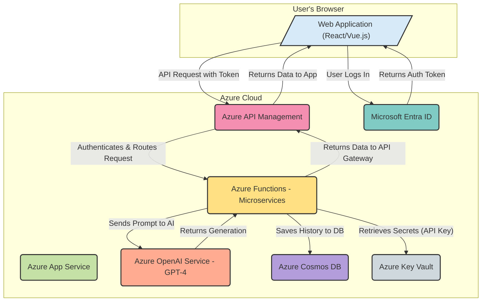

# AdGenie: The AI-Powered Product Description Writer

## Summary

**AdGenie** is a simple web tool designed for small to medium-sized e-commerce sellers. It uses generative AI to instantly create engaging, persuasive, and SEO-friendly product descriptions. A seller simply inputs a product name and a few key features as bullet points, and AdGenie generates several description options in different tones (e.g., professional, playful, luxurious) that they can use for their online store, marketplace listings, or social media posts.

## Challenge/Business Opportunity

The primary challenge is that many online sellers are not expert copywriters. Writing compelling product descriptions that attract customers and rank well in search engines is difficult and time-consuming. This leads to poor-quality listings, lower conversion rates, and lost sales.

The business opportunity is to provide a powerful yet simple tool that empowers any seller to create high-quality marketing copy in seconds. This directly addresses a major pain point for millions of sellers on platforms like Shopify, Etsy, eBay, and Amazon.

**Scalability**: This idea is extremely scalable. As a web-based SaaS (Software as a Service) tool, it can serve an unlimited number of customers. It can be offered with a freemium model or tiered subscriptions based on usage. The core AI model can be easily adapted to generate descriptions in multiple languages, for different product categories, and for various platforms with specific formatting requirements.

## Novelty of the idea, benefits and risks.

The **novelty** lies in its focused simplicity and customisation for e-commerce sellers. While general-purpose AI writers exist, AdGenie is specifically trained and prompted to understand the nuances of product marketing, including calls-to-action, feature-to-benefit translation, and SEO keyword integration.

**Benefits**:

- **Saves Time**: Drastically reduces the time spent on writing copy.
- **Improves Quality**: Creates professional-grade descriptions, improving brand perception and sales.
- **Boosts SEO**: Generates keyword-rich text to improve search engine visibility.
- **Overcomes Writer's Block**: Provides instant inspiration and multiple creative options.

**Risks**:

- **Generic Content**: If not prompted correctly, the output could be generic. Mitigation involves advanced prompt engineering and offering customization options (tone, length).
- **Factual Inaccuracies**: The AI might "hallucinate" or generate incorrect details about a product. Mitigation is to clearly instruct users to review and edit the generated text before publishing.
- **Over-reliance**: Users may become too reliant on the tool and lose the brand's unique voice.

## Highlight adherence to Responsible AI principles such as Security, Fairness, Privacy & Legal compliance.

- **Transparency**: The tool will clearly state that the descriptions are AI-generated and should be reviewed by a human before use.
- **Fairness**: The underlying AI model will be prompted to avoid using biased, stereotypical, or harmful language in the product descriptions.
- **Privacy**: User inputs (product features) will be handled securely. We will have a clear data policy stating that proprietary product information is not used to train the public model.
- **Accountability & Security**: We will implement content filters to prevent the tool from being used to generate descriptions for prohibited or dangerous items. User authentication will be handled securely via services like **Microsoft Entra ID**.

## Technical Approach and Architecture (Azure)

This idea can be prototyped with a very simple and serverless architecture, making it perfect for a hackathon.

- **Frontend**: A simple web interface built with a framework like React or Vue.js, hosted as a static web app on **Azure App Service**.
- **Backend Logic**: A serverless **Azure Function** (HTTP Trigger) that takes the user's input from the frontend.
- **AI/ML**: The Azure Function makes a secure API call to the **Azure OpenAI Service**, using a powerful model like GPT-3.5 or GPT-4. The core of the application will be the carefully crafted prompt sent to the model.
- **Database**: For a hackathon prototype, no database is needed. For a full product, **Azure Cosmos DB** could store user accounts and generation history.

### Development Timeline

This is highly achievable in a 2-day timeframe.

- **Day 1 (Morning)**: Set up Azure resources (App Service, Function, OpenAI). Design the simple UI.
- **Day 1 (Afternoon/Evening)**: Develop the Azure Function to call the OpenAI API. Begin "prompt engineering" – designing and testing the master prompt that guides the AI's output.
- **Day 2 (Morning)**: Connect the frontend to the backend function. Add options for selecting a "tone of voice."
- **Day 2 (Afternoon)**: Test the end-to-end flow, refine the UI, and prepare the demo and presentation.

### Success Metrics and Expected Outcomes

- **Success Metrics**:
    - **Task Completion Rate**: Percentage of users who successfully generate a description.
    - **Time to Generate**: Speed of the entire process from input to output.
    - **User Satisfaction**: A simple "thumbs up/down" on the quality of the generated text.
- **Expected Outcomes**: A working web application where a user can enter a product title and features, select a tone, and receive at least three well-written product description options.

## Reference

- **Azure OpenAI Service:** This is the core AI engine. This page provides an overview, quickstarts, and concepts for using models like GPT-4.
    - [Azure OpenAI Service Documentation](https://learn.microsoft.com/en-us/azure/ai-services/openai/overview)
- **Azure Functions:** This is the serverless backend that will process requests. This link takes you to the documentation hub.
    - [Azure Functions Documentation](https://learn.microsoft.com/en-us/azure/azure-functions/)
- **Azure App Service:** This is where you would host the user-facing web application.
    - [Azure App Service Documentation](https://learn.microsoft.com/en-us/azure/app-service/)
- **Microsoft Entra ID (for User Authentication):** The documentation for securing your application with user sign-in.
    - [Microsoft Entra ID for Developers](https://www.google.com/search?q=https://learn.microsoft.com/en-us/entra/identity/developer/overview)

### Better Options and Enhancements for Customers

To make AdGenie an indispensable tool for sellers, you can add powerful new features.

- **Browser Extension 💡**: Create a browser extension for Chrome, Edge, or Firefox. This would allow a seller to generate a product description **directly on the product listing page** of their e-commerce platform (e.g., Shopify, Etsy). They wouldn't even need to leave the page they are working on, making the workflow seamless.
- **Bulk Generation Feature**: Instead of one product at a time, allow users to **upload a CSV file** with hundreds of product names and features. AdGenie could then process the entire file and return a new CSV with a generated description for every single product, saving an enormous amount of time for sellers with large catalogs.
- **Image-to-Description Generation ✨**: This is a game-changer. Use a multi-modal model (like GPT-4 with Vision on Azure) to allow the user to **upload a product image**. The AI would first "see" the image and generate a list of key features (e.g., "red cotton t-shirt, short sleeves, crew neck"). Then, it would feed those features into the text model to write the description. This nearly fully automates the entire process.